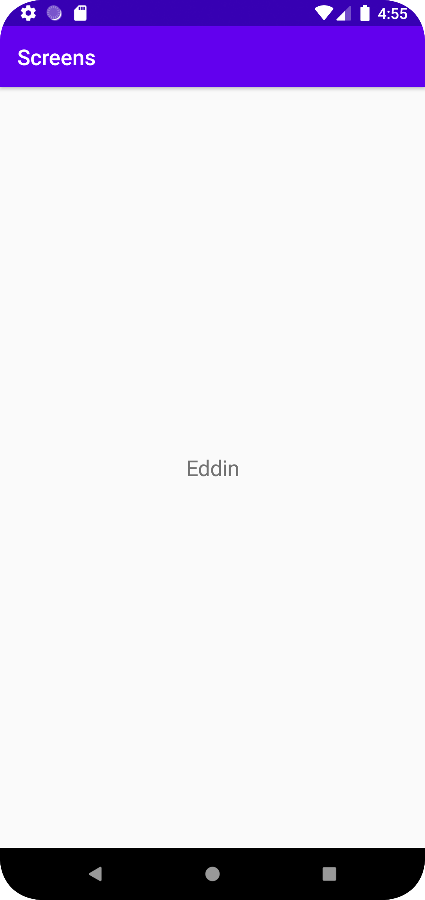

En ny aktivitet gjordes genom file -> new -> activity -> empty activity. Därefter skapades en button widget i activity.main.xml, allt placerades med constraintLayout.
För att knappen skulle öppna en ny aktivitet när tryckt på behövdes en onClickListener läggas till på button i onCreate().
onClickListener ska enligt min kod köra metoden openActivity2() när tryckt vilket betyder att en sådan metod behövdes göras.
I openActivity2() skapades en ny intent, data lades till med extra som sedan skulle föras över till den andra aktiviteten samt att startActicity(intent) skrevs.
i den andra aktiviteten instansierades en bundle med namn extras som fick värdet av "getIntent().getExtras()".
Om extras hade ett värde skulle den ta aktivitet 1 värde och visa det i textView.

```
@Override
       protected void onCreate(Bundle savedInstanceState) {
           super.onCreate(savedInstanceState);
           setContentView(R.layout.activity_main);

           Button button = (Button) findViewById(R.id.button);
           button.setOnClickListener(new View.OnClickListener() {
               @Override
               public void onClick(View v) {
                   openActivity2();
               }
           });
       }

       public void openActivity2() {
           Intent intent = new Intent(MainActivity.this, MainActivity2.class);
           intent.putExtra("name", "Eddin");
           startActivity(intent);
       }
```

```
TextView textView;

    @Override
    protected void onCreate(Bundle savedInstanceState) {
        super.onCreate(savedInstanceState);
        setContentView(R.layout.activity_main2);

        textView = findViewById(R.id.activity2);
        Bundle extras = getIntent().getExtras();
        if (extras != null) {
            String name = extras.getString("name");
           textView.setText(name);
        }
    }
```



